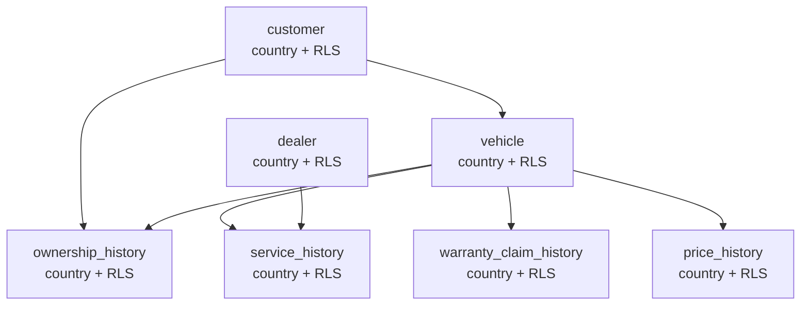

# TableLink

여러 테이블을 자동으로 탐지하고 조인 경로를 스스로 찾아, 조건만으로 고객 세그먼트를 뽑아내는 도구.

[](https://itssophie.dev/tablelink/)


로그인 데모 계정: `kr_user` / `us_user` / `admin` (비밀번호 전부 `tablelink1234`) — 국가별로
다른 데이터가 보임.

---

## 왜 만들었나

세그먼트 도구는 보통 카테고리별로 원본 테이블을 미리 반정규화해 고객 키가 박힌 넓은 마트로
만들어두는 방식을 씀. 조인은 쉬워지지만 카테고리 하나 늘 때마다 마트를 새로 설계·구축해야
함 (ETL, 중복 저장, 최신성 저하).

**TableLink는 반대로 감**: 마트를 만들지 않고 원본 정규화 스키마 그대로 둔 채, 테이블 성격
(STATE/HISTORY)에 따라 조인 전략과 경로를 그때그때 자동 탐색.

```sql
-- 단순 키 조인 (틀림) — 소유 기간과 무관한 정비 기록까지 다 붙음
JOIN service_history s ON o.vehicle_id = s.vehicle_id

-- TableLink가 자동 생성하는 조인 — 구간 조건 포함
JOIN service_history s
  ON o.vehicle_id = s.vehicle_id
  AND s.service_date BETWEEN o.start_date AND COALESCE(o.end_date, CURRENT_DATE)
```

---

## 설계가 바뀐 지점들

| 초기 설계 | 문제 | 변경 |
|---|---|---|
| 테이블을 사용자가 직접 등록 (STATE/HISTORY 수동 입력) | 이미 DB 스키마에 다 있는 정보 | `information_schema` + 네이밍 컨벤션으로 자동 판정 |
| 그래프 탐색 없이, 드래그앤드롭으로 중간 테이블 직접 연결 | 조건 먼저 고르는 흐름에선 몇 테이블 거쳐야 하는지 사용자가 알 수 없음 | BFS 최단경로 기반 자동 연결 |
| 조인 화면과 조건 화면을 분리 | 자동연결 후 조인 화면에서 할 일이 거의 없어져 페이지만 왕복 | 조건 화면 하단 실시간 패널로 통합 |

---

## 실제로 겪은 버그

| 증상 | 원인 | 수정 |
|---|---|---|
| `integer < character varying` 타입 오류 | JDBC가 필터 값을 전부 텍스트로 바인딩 | 컬럼 실제 타입 조회 후 `?::integer` 캐스팅 |
| 멀티홉 조인에서 결과가 갑자기 0건 | "최신값만" 조건이 같은 HISTORY 테이블에 두 번 겹쳐 AND | HISTORY 테이블이 트리에 처음 들어올 때만 적용 |
| 세그먼트 결과가 "전체 딜러 대비 N%"로 계산됨 | 조인 루트가 조건 고른 순서에 따라 바뀜 | `customer`를 항상 루트로 고정 |
| RLS `DO $$ ... $$` 블록이 `schema.sql` 실행 시 파싱 에러 | Spring 스크립트 실행기가 Postgres 달러 인용을 모름 | 테이블 7개분을 반복문 없이 풀어서 작성 |
| `set_config()` 호출 시 "결과가 반환됨" 에러 | `set_config`는 값을 반환하는 쿼리인데 `.update()`로 호출 | `.queryForObject()`로 수정 |

---

## 유저·국가별 데이터 격리 (Row-Level Security)



**왜 7개 테이블 전부**: `customer`가 항상 조인 루트라 `customer`/`dealer`만 막아도 될 줄
알았으나, `GET /tables/{name}/preview`처럼 조인 엔진을 거치지 않고 테이블에 바로 쿼리하는
엔드포인트가 있어서 전제가 깨짐. 전 테이블에 적용.

**핵심 메커니즘**

| 구성 요소 | 내용 |
|---|---|
| 격리 방식 | `FORCE ROW LEVEL SECURITY` (없으면 테이블 소유자가 정책을 그냥 우회) |
| SELECT 정책 | `country = current_setting('app.current_country')` OR `= 'ALL'`(admin) |
| INSERT 정책 | `WITH CHECK (true)` — 시드 데이터는 로그인 없이도 들어가야 함 |
| 컨텍스트 주입 | 요청마다 트랜잭션 안에서 `set_config('app.current_country', ?, true)` |
| 커넥션 풀 안전성 | `SET`이 아니라 `SET LOCAL` 방식 — HikariCP가 재사용해도 이전 요청 설정이 안 새어나감 |

이 방식의 핵심: `JoinService`의 SQL 생성 로직은 country를 전혀 몰라도 됨. 어떤 조인이
만들어지든 DB가 알아서 걸러줌.

**실무라면 더 볼 것**: GUC 미설정 시 조용히 0건(디버깅 함정) · 트랜잭션 오버헤드 · 이중
프록시 환경의 쿠키 처리 · 비밀번호+해시만으론 rate limiting 없이 무차별 대입에 노출 ·
`country`가 인증/언어/테넌시를 겸함(실무면 분리) · 계정 3개짜리에 DB 레벨 RLS는 기법
시연 목적의 의도적 과잉.

---

## 기술 스택

| 영역 | 사용 기술 |
|---|---|
| Backend | Spring Boot 4.1.1, Java 21, Spring Data JPA, JdbcTemplate, Spring Security |
| DB | PostgreSQL 16 (`information_schema` 자동 스키마 판정, Row-Level Security) |
| Frontend | React 19, Vite, React Flow(`@xyflow/react`) |

조인 SQL은 Strategy 패턴(`JoinStrategy`/`JoinStrategyFactory`)으로 STATE-STATE /
STATE-HISTORY / HISTORY-HISTORY 세 케이스 분리. 필터 컬럼은 화이트리스트
(`filterableColumns`) 검증 후에만 SQL에 사용 — PreparedStatement가 바인딩 못 하는
컬럼명 자리라 화이트리스트로 방어.

설계 배경 상세: [project-spec.md](project-spec.md)

---

## 로컬 실행

```bash
docker run --name tablelink-postgres -e POSTGRES_DB=tablelink \
  -e POSTGRES_USER=tablelink -e POSTGRES_PASSWORD=tablelink \
  -p 5432:5432 -d postgres:16

cd backend && ./mvnw spring-boot:run        # 8080
cd frontend && npm install && npm run dev   # 5173
```

## 배포

`itssophie.dev/tablelink` — 구성 상세는 [project-spec.md 배포 섹션](project-spec.md#11-배포).
