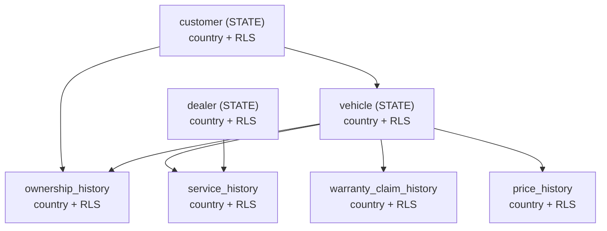

# TableLink

여러 테이블을 자동으로 탐지하고 조인 경로를 스스로 찾아, 조건만으로 고객 세그먼트를 뽑아내는 도구.

**Live**: [itssophie.dev/tablelink](https://itssophie.dev/tablelink/)

---

## 왜 만들었나

실무에서 세그먼트 도구를 다루다 보면 흔한 방식이 있음: 카테고리(도메인)별로 원본 테이블들을
미리 반정규화해서 넓은 마트 테이블 하나로 만들고, 그 마트에 고객 키를 항상 포함시켜 마트끼리는
고객 키로 조인만 하면 되게 만드는 방식. 조인 자체는 쉬워지지만, 세그먼트 조건에 새 카테고리를
추가할 때마다 그 카테고리의 마트를 새로 설계·구축해야 함. 테이블 구조를 마음대로 바꾸기 어려운
현업에서는 이게 매번 상당한 비용 — ETL을 새로 짜야 하고, 데이터가 중복 저장되며, 배치 주기만큼
최신성이 떨어짐.

TableLink는 반대 방향을 택함. 마트를 미리 만들어두는 대신 원본 정규화 스키마를 그대로 두고,
테이블의 성격(현재값만 유지하는 STATE, 시간에 따라 쌓이는 HISTORY)에 따라 조인 전략을 자동으로
정하고 조건에 필요한 조인 경로도 그때그때 탐색. 새 테이블이 추가돼도 마트를 새로 만들 필요 없이
바로 세그먼트 조건으로 사용 가능.

```sql
-- 단순 키 조인만으로는 틀린 결과가 나오는 경우 (HISTORY-HISTORY)
SELECT * FROM ownership_history o
JOIN service_history s ON o.vehicle_id = s.vehicle_id;
-- 문제: 소유 기간과 무관한 정비 기록까지 다 붙음

-- 올바른 조인 (구간 조건 포함)
SELECT * FROM ownership_history o
JOIN service_history s
  ON o.vehicle_id = s.vehicle_id
  AND s.service_date BETWEEN o.start_date AND COALESCE(o.end_date, CURRENT_DATE);
```

---

## 설계가 바뀐 지점들

- **테이블 등록 화면 → 스키마 자동 판정**: 처음엔 사용자가 테이블 성격(STATE/HISTORY)을
  직접 입력하게 했으나, 이 정보는 이미 DB 스키마에 존재. `information_schema` 조회 +
  네이밍 컨벤션으로 자동 판정하도록 변경하고, 사람이 정할 몫은 "필터로 노출할 컬럼
  화이트리스트"만 남김.
- **그래프 탐색 없이 간다 → 번복**: 처음엔 드래그앤드롭으로 중간 테이블까지 사용자가 직접
  잇게 하려 했으나, 조건(필드)을 먼저 고르는 흐름에서는 몇 테이블을 거쳐야 연결되는지
  사용자가 미리 알 수 없는 구조. 이 규모(테이블 7개)에서는 그래프 탐색이 전혀 무겁지 않다는
  걸 확인하고, BFS 최단경로 기반 자동 연결로 전환.
- **조인 화면과 조건 화면 분리 → 병합**: 자동 연결이 들어오자 조인 화면에서 사용자가 내릴
  결정이 "최신값만 볼지" 토글 정도로 축소됐는데도, 조건 하나 바꿀 때마다 페이지를 오가야 하는
  구조. 관계도를 조건 화면 하단의 실시간 갱신 패널로 통합.

---

## 실제로 겪은 버그

- **필터 값의 암묵적 타입**: JDBC가 모든 필터 값을 텍스트로 바인딩해서, 숫자/날짜 컬럼에
  `>`/`<`를 걸면 Postgres가 `integer < character varying` 타입 불일치로 거부. 컬럼의
  실제 타입을 조회해 `?::integer`처럼 명시적으로 캐스팅하도록 수정.
- **"최신값만" 조건이 두 번 겹침**: 멀티홉 조인에서 같은 HISTORY 테이블이 두 개의 STATE
  테이블과 연달아 연결될 때, 두 연결 모두에 "최신값만" 조건이 기본으로 붙어 서로 다른
  기준의 narrowing이 AND로 겹치면서 결과가 사라지는 문제. HISTORY 테이블이 트리에 새로
  들어올 때만 기본으로 켜지도록 수정.
- **세그먼트 분모 문제**: 조인 트리의 루트가 조건을 고른 순서에 따라 바뀌어서, 딜러 조건을
  먼저 걸면 결과가 "전체 딜러 대비"로 계산되는 문제. 고객을 조건 순서와 무관하게 항상
  루트로 고정.
- **RLS 구축 중 겪은 두 가지**: Postgres RLS 정책 생성을 `DO $$ ... $$` 블록 하나로 묶었더니
  `psql`로는 정상 동작하는데 Spring Boot가 `schema.sql`을 실행할 때는 "unterminated dollar
  quote"로 실패 — Spring의 스크립트 실행기는 `;` 기준으로만 문장을 나눠서 Postgres 전용
  달러 인용 구문을 인식하지 못함. 테이블 7개분을 반복문 없이 풀어서 작성. 그리고
  `SELECT set_config(...)`를 `JdbcTemplate.update()`로 실행했다가 "결과가 반환됐는데
  없어야 한다"는 에러 발생 — `set_config`는 값을 반환하는 **쿼리**라 `queryForObject`로 수정.

---

## 유저·국가별 데이터 격리 (Row-Level Security)

"로그인한 유저마다 자기 국가의 데이터만 봐야 한다"는 요구를 가정하고 실제로 구현한 기능.
라이브 데모에 로그인 화면이 있고, 계정 세 개(`kr_user`/`us_user`/`admin`, 비밀번호
`tablelink1234`)로 각각 한국어 데이터셋, 영어 데이터셋, 국가 제한 없는 전체 데이터셋 조회를
확인할 수 있음.

### 어디에 경계를 둘지



처음엔 "`customer`가 항상 조인 트리의 루트로 고정돼 있으니 `customer`/`dealer` 두 테이블에만
country + RLS를 걸면 나머지는 FK를 타고 자동으로 보호된다"고 판단. 그런데
`GET /tables/{name}/preview`, `.../columns/{col}/domain`처럼 **조인 엔진을 거치지 않고
테이블에 바로 쿼리하는 엔드포인트**가 이미 존재한다는 점에서 이 전제가 무너짐 —
`vehicle`을 직접 조회하면 조인 루트와 무관하게 전체 국가 데이터가 노출. 결론적으로 7개 테이블
전부에 country + RLS를 거는 쪽으로 확정.

### 접근 방식

Postgres Row-Level Security로 처리해서, 애플리케이션의 SQL 생성 로직(`JoinService` 등)은
country를 아예 몰라도 되는 구조가 핵심. 어떤 조인 모양이 생성되든 DB가 알아서 걸러주기 때문에,
이 프로젝트의 핵심 가치인 "동적 SQL 생성"과 잘 맞음.

- `ALTER TABLE ... ENABLE/FORCE ROW LEVEL SECURITY` — `FORCE`가 없으면 테이블 소유자(앱 DB
  계정)는 정책을 그냥 무시하고 지나가서, 결과적으로 필터링이 전혀 걸리지 않는 구조
- SELECT용 정책은 `country = current_setting('app.current_country', true)`가 기본이고,
  `admin` 계정을 위해 `OR current_setting(...) = 'ALL'`을 추가해 국가 제한 없이 조회 가능하도록
  구성. 시드 데이터 삽입을 막지 않도록 별도의 INSERT용 `WITH CHECK (true)` 정책도 분리
- 요청마다 트랜잭션 안에서 `SELECT set_config('app.current_country', ?, true)`를 먼저 실행
  — 커넥션 풀(HikariCP)이 이전 요청의 설정을 다음 요청에 물려주지 않도록, 세션 전역 `SET`이
  아니라 트랜잭션 범위인 `SET LOCAL`/`set_config(..., is_local=true)` 사용

### 실무라면 더 신경 써야 할 것 (짧게)

1. GUC 미설정 시 결과가 조용히 0건으로 반환 — 에러가 아니라서 디버깅 함정
2. 원래 오토커밋이던 조회를 트랜잭션으로 감싸는 데 따른 오버헤드
3. 세션 쿠키가 이중 프록시(엣지→오리진)를 거치므로 `credentials: 'include'`, 쿠키 도메인/경로
   확인 필요
4. "쉬운 비밀번호 + 해시"는 유출 방지 수단일 뿐, rate limiting 없이는 무차별 대입에 그대로 노출
5. `country`가 인증 스코프·언어·데이터 테넌시를 한 필드로 겸함 — 실제 시스템이라면 분리가
   맞는 방향
6. 소수 계정짜리 문제에 DB 레벨 RLS까지 쓰는 것은 문제 크기 대비 과함 — 여기선 기법을
   보여주기 위한 의도적 선택

---

## 기술 스택

- **Backend**: Spring Boot 4.1.1 (Java 21), Spring Data JPA, JdbcTemplate
- **DB**: PostgreSQL 16 — `information_schema` 조회로 스키마 자동 판정
- **Frontend**: React 19, Vite, React Flow(`@xyflow/react`)로 관계도 시각화

조인 SQL 생성은 Strategy 패턴(`JoinStrategy`/`JoinStrategyFactory`)으로 STATE-STATE,
STATE-HISTORY, HISTORY-HISTORY 세 케이스를 분리했고, 필터는 컬럼명을 화이트리스트
(`filterableColumns`)로 검증한 뒤에만 SQL에 사용 — 컬럼명은 PreparedStatement 파라미터
바인딩이 불가능한 자리라 화이트리스트로 방어.

더 자세한 설계 배경은 [project-spec.md](project-spec.md)에 정리.

---

## 로컬 실행

```bash
# DB
docker run --name tablelink-postgres -e POSTGRES_DB=tablelink \
  -e POSTGRES_USER=tablelink -e POSTGRES_PASSWORD=tablelink \
  -p 5432:5432 -d postgres:16

# Backend (8080)
cd backend && ./mvnw spring-boot:run

# Frontend (5173, /tables /joins /segments는 8080으로 프록시)
cd frontend && npm install && npm run dev
```

## 배포

`itssophie.dev` 도메인 아래 `/tablelink` 경로로 배포. 자세한 내용은
[project-spec.md의 배포 섹션](project-spec.md#11-배포) 참고.
